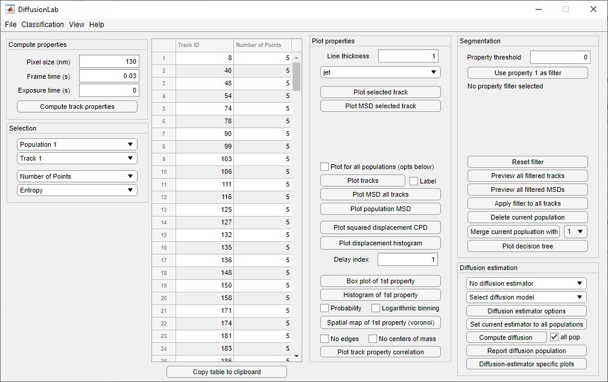
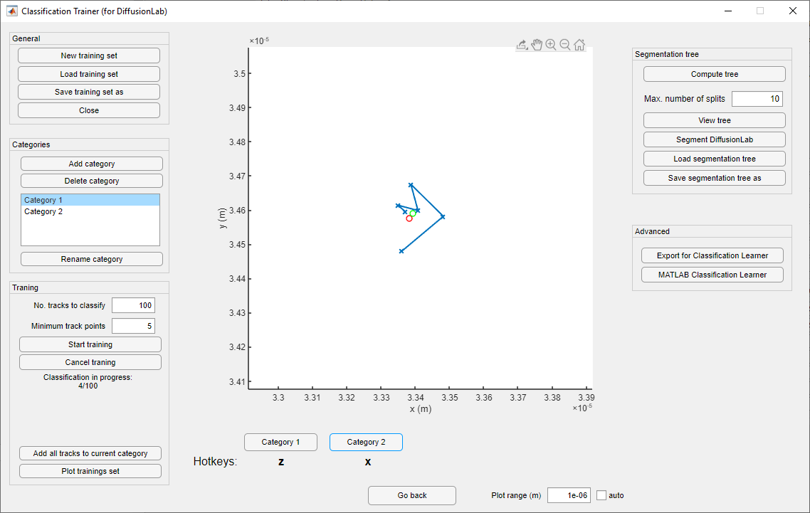
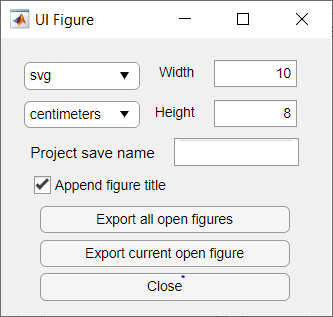

DiffusionLab GUI
=================

Assuming that DiffusionLab has been installed, the graphical user interface (GUI) can be found and opened in the APP toolstrip under 'MY APPS'. The GUI of DiffusionLab is given in :numref:`Figure  %s <fig-GUI_main>`. The options will be discussed in the sections below.

.. _fig-GUI_main:

   Overview of the graphical user interface (GUI) of DiffusionLab

Import & Save Tracks
-----------------------

Tracks can be imported from DoM results tables, Localizer text files, and COMSOL text files with the options in the menu :guilabel:`File` > :guilabel:`Import tracks`. Loading of large files can take while; DiffusionLab will output the path of the loaded file followed by ‘done’ in the Command Window once the loading has been completed.

In order to do quantitative (motion) analysis of the trajectories, the track settings have to be set in the `Compute properties` panel. The :guilabel:`Pixel size` is the length of a single pixel edge in nanometers, the :guilabel:`Frame time` the time between frames in seconds, and :guilabel:`Exposure time` is the time the shutter is open per frame in seconds. This assumes that the time in raw data is given in frames and the coordinates in pixels. If not, these values should be considered as a conversion factor from the unit in the raw data to the unit given in the GUI (see Hint). The :guilabel:`Exposure time` is only used to compute the motion blur constant in the diffusion constant estimators following the Berglund camera-based single-particle tracking model. [#f1]_ It can be set to zero to not include motion blur in the analysis.

.. hint::
	If the coordinates in the raw data are given in micrometers, the :guilabel:`Pixel size` is 1000 (nanometer/micrometer). This situation often occurs when working with simulated tracks, e.g. from COMSOL.
	
.. note::
	The pixel size, frame time, and exposure time can be changed anytime, and all new figures are plotted with the new values.

The current DiffusionLab session can be saved and restored via :guilabel:`File` > :guilabel:`Load` / :guilabel:`Save`. The saved file has an extension *.mat.

Segmentation
---------------

The :ref:`standard track properties <ch-trackProperties-standard>` of the loaded tracks are computed with :guilabel:`Compute track properties`. Additionally, the mean squared displacement (MSD) values are computed for plotting and fitting.

The Population is a group of tracks with similar motion characteristics. Populations can be managed in the `Segmentation` panel. The current Population can be selected in the first dropdown menu :guilabel:`Population #` in the `Selection` panel. Each Population has a number of Tracks, which can be selected based on the Track ID in the second dropdown menu :guilabel:`Track #`. The computed track properties can be selected in the bottom two menu’s, which are respectively the :guilabel:`Track property 1` and :guilabel:`Track property 2`.

Custom features
-----------------
Custom features can be added to DiffusionLab. These features are coded in separate files (scripts) by the user. Instructions to code the features can be found in a template located at src/classes/@tracks/feature_template/featureTemplate.m in the GitHub repository.  One or more of these 'feature scripts' can be loaded in the DiffusionLab GUI via :guilabel:`File` > :guilabel:`Load feature script`. The selected scripts are automatically executed and the features appear in the software and can be used like any of the build-in features. These features are also automatically computed for the training set in the Classification Trainer App (see below). The features have to be removed from the loaded feature scripts list before the Classification Trainer App is opened, if they should not be computed for the training set. This can be done by opening the file selection dialog via :guilabel:`File` > :guilabel:`Load feature script` and pressing :guilabel:`Cancel`.

Property table
++++++++++++++++

The properties of the individual tracks are displayed in the track table. The population and track property of interest can be set using :guilabel:`Population #` and :guilabel:`Track property 1`, respectively. All tracks within a population have a unique track ID, which can be used to find the track back in the :guilabel:`Plot tracks` using the :guilabel:`Label` option. The tracks are sorted from low to high value of their current property. Invalid values are indicated by NaN.

.. warning::
	The track IDs change when tracks are added or removed from a population and do not remain constant after these operations.

Manual Segmentation 
++++++++++++++++++++

Segmentation is performed on the current :guilabel:`Population #` with the :guilabel:`Track property 1`. The threshold value is given in the field :guilabel:`Property threshold` and must be a scalar numeric value. The filter is selected via :guilabel:`Use property 1 as filter`, but not directly applied. The settings during the filter selection are saved and the filter has to be reapplied when the user wishes to change :guilabel:`Population #` or :guilabel:`Track property 1`. The tracks and MSD can be plotted with :guilabel:`Preview all filtered tracks` and :guilabel:`Preview all filtered MSDs` and the filter can be applied with :guilabel:`Apply filter to all tracks` or deleted with :guilabel:`Reset filter`. The :guilabel:`Delete current population` button deletes the currently selected population and cannot be reversed. The currently selected :guilabel:`Population #` can be merged using :guilabel:`Delete current population` with the population number in the dropdown menu next to the button. This resets the diffusion constant estimator and the motion analysis settings will be lost. The result of the all segmentation steps can be displayed as decision tree with the :guilabel:`Plot decision tree` button.

.. note::
	Selection of a filter via :guilabel:`Use property 1 as filter` allows the user to preview filtered tracks and their mean squared displacements. This allows manual tweaking of the :guilabel:`Property threshold`. The application of the filter to the current population is done via the :guilabel:`Apply filter to all tracks` button.

Segmentation Using Machine Learning
+++++++++++++++++++++++++++++++++++++++

The trajectories can be segmented with a classification tree or other supervised machine learning tools available in MATLAB. DiffusionLab comes with an additional tool that allows the user to create a training set for supervised machine learning. This tool *Classification Trainer (for DiffusionLab)* allows rapid manual classification of trajectories in up to five user-defined categories, and is shown in :numref:`Figure  %s <fig-GUI_classification>`. It can be opened via :guilabel:`Classification` > :guilabel:`Classification Trainer` in the DiffusionLab main window. The training set can be used to train a classification tree or be imported into MATLAB's `Classification Learner app <https://nl.mathworks.com/help/stats/classificationlearner-app.html>`_.

.. _fig-GUI_classification:

   Overview of the graphical user interface (GUI) for classification.

The current population that is open in DiffusionLab when opening Classification Trainer is loaded and made available for classification in Classification Trainer. A new training set is started by pressing :guilabel:`New training set` or saved training set can be loaded directly via :guilabel:`Load training set` in the `General` panel. Up to five categories can be added via :guilabel:`Add category` and deleted likewise with :guilabel:`Delete category`. Deletion of a category results in the permanent deletion of the tracks from the training set. The categories can be named with :guilabel:`Rename category` and these names are stored in the population and used as label in the decision tree when displayed using :guilabel:`Plot decision tree` in the DiffusionLab main window.

.. note::
	The training set is saved in SI units and is thus compatible regardless the pixel size and frame time of processed data sets. This means that the pixel size and frame time cannot be changed after the classified tracks have been added to the training set.
	
Training is done in batches. The number of tracks per batch is given in the field :guilabel:`No. tracks to classify` and the minimum number of track points in the batch is given in the field :guilabel:`Minimum track points` in the `Training` panel. The progress of the training is followed in the text field in the `Training` panel. Preliminary cancellation with :guilabel:`Cancel training` results in no tracks from that batch being added to the training set. During training, user is shown a plot of a trajectory and asked to classify this track into one of the created categories. The red dot is the minimum bounding circle center and the green dot the center of mass of the track. The scale of the plot can be set :guilabel:`Auto` for auto scale or a manual :guilabel:`Plot range (m)` can be given in meters. Assignment of a track into a category can be done by clicking the respective button or via the hotkeys marked below. The last assignment can be redone by pressing :guilabel:`Go back` and allows the user to revisit the classification of the last track.

.. hint::
	To create a training set with tracks from multiple data sets, one can save the training set and open it when a different data set is loaded from DiffusionLab. The trained tracks from the new data set will be appended to the loaded training set.
	
.. hint::
	If the hotkeys do not respond, please click next to plot window.

A decision tree can be trained from the currently loaded training set in the panel `Segmentation tree`. The tree is computed with :guilabel:`Compute tree` and the mximum number of splits allowed in the decision tree is set in the field :guilabel:`Max. number of splits`. The tree is displayed in the log window and plotted after computation or via the button :guilabel:`View tree`. The tree uses all :ref:`standard track properties <ch-trackProperties-standard>` for training. The currently opened population in DiffusionLab can be segmented with this tree using :guilabel:`Segment DiffusionLab`. This action will close the Classification Trainer and open DiffusionLab with the segmentation executed.

.. note::
	The splits of the classication tree are not included in the decision tree available in the DiffusionLab main window :guilabel:`Plot decision tree`. Please save the decision tree before proceeding with :guilabel:`Segment DiffusionLab`.

The classification and track properties of the tracks in the training set can be exported for MATLAB's  Classification Learner app via :guilabel:`Export for Classification Learner`. The Classification Learner app can be opened with :guilabel:`MATLAB Classification Learner`. Here, also a subset of track properties can be selected for classification and the full toolbox of supervised machine learning in MATLAB can be used including:

* Decision trees
* Discriminant analysis
* Naive Bayes classifiers
* Support vector machines
* Nearest neighbor classifiers
* Ensemble classifiers

Classification Learner can also be opened from the DiffusionLab main window via :guilabel:`Classification` > :guilabel:`MATLAB Classification Learner`. The trained model in Classification Learner can be `exported <https://nl.mathworks.com/help/stats/export-classification-model-for-use-with-new-data.html>`_ via :guilabel:`export model` or :guilabel:`export compact model`. The current population in DiffusionLab can be segmented with this saved model via :guilabel:`Classification` > :guilabel:`Segment with model CL`.

Visualization
---------------

The tracks and their properties can be plotted in the `Plot properties` menu. The :guilabel:`Line thickness` and :guilabel:`Colormap` can be set for all plots. The currently selected :guilabel:`Track #` and its properties can be plotted with :guilabel:`Plot selected track` and its mean squared displacement curve with :guilabel:`Plot selected MSD`. 

When the checkbox :guilabel:`Plot for all populations (opts below)` is selected, all populations are plotted in a single figure, while when the checkbox is unselected only the current :guilabel:`Population #` is plotted. :guilabel:`Plot tracks` displays the coordinates of all tracks and the :guilabel:`Label` check box toggles the Track IDs of the last plot. This functionality remains after plotting and can be used to correlate the track’s coordinate to its properties. :guilabel:`Plot MSD` shows the mean squared displacement curves of population(s). :guilabel:`Box plot of 1st property` plots a box plot of the current :guilabel:`First property` with the central mark indicating the mean, the box top and bottom edges the 25th and 75th percentiles, respectively, and the whiskers the most extreme data points that are not considered outliers. Outliers are indicated with plus symbols. :guilabel:`Histogram of 1st property` plots a histogram of the :guilabel:`First property` with counts or probability selected with the :guilabel:`Probability` checkbox and linear or logarithmic binning toggled by the :guilabel:`Logarithmic binning` checkbox. :guilabel:`Plot squared displacement` is a special case of the histogram plot and and uses the same (:guilabel:`Probability` and  :guilabel:`Logarithmic binning`) checkboxes. It plots the squared displacement after a set :guilabel:`Delay index:` in the number of frames, which should be an integer. The :guilabel:`Spatial map of the 1st property` plots a Voronoi diagram of the track’s center of mass coordinates. The tracks at the edges are enclosed by a convex hull. If the spatial map is plotted for a single population, the color of the Voronoi cells represents the value if the :guilabel:`First property`. The :guilabel:`No edges` checkbox toggles whether the edges of the Voronoi cells are plotted and the :guilabel:`No centers of mass` checkbox toggles whether the centers of mass are plotted. :guilabel:`Plot track` property correlation plots the correlation between the :guilabel:`First property` and :guilabel:`Second property`. Diffusion estimator specific plots generates a popup menu in which a plot can be selected. The menu is only available when a diffusion estimator has been computed. These plots might use the current :guilabel:`Track #`.

.. hint::
	The :guilabel:`Delay index` can be set as an individual number (e.g. 2), as a vector of individual numbers (e.g. 2,4,5,9), or as a vector with a regular interval (e.g. 1:5 = 1,2,3,4,5 and 1:2:9 = 1,3,5,7,9) following MATLAB's syntax.

Display units
+++++++++++++++

The units used to display and export properties and motion analysis are dependent on the length and time scale of the trajectories. Therefore, the display units can be set manually in :guilabel:`View` > :guilabel:`Units`. Default units are SI units. Like the pixel size, frame time, and exposure time, these changes have direct effect on the track table and on all newly plotted figures.

Motion Estimation
-------------------

The diffusion constant can be computed per track, population or both, depending on the selected estimator in the dropdown meanu :guilabel:`No diffusion estimator`. The diffusion model is selected in the dropdown menu :guilabel:`Select diffusion model`, which is automatically updated with the available models for the current diffusion estimator. :guilabel:`Diffusion estimator options` button gives a pop-up menu in which the settings for diffusion estimation can be tailored. For additional information on the required input, type “doc Dest” in the MATLAB Command Window and select the diffusion estimator for more information. :guilabel:`Set current estimator to all populations` sets the current estimator and its settings to all populations. :guilabel:`Compute diffusion` computes the diffusion constant per track, population or both depending on the diffusion estimator. The :guilabel:`all pop.` checkbox allows the user to compute the diffusion for all populations. Fit results for individual tracks are added to the track properties and fit results of the population can be displayed using :guilabel:`Report diffusion population`. Plots that are only available for a specific diffusion estimator can be displayed via :guilabel:`Diffusion-estimator specific plots`. Some plots display results per track and the current track :guilabel:`Track #` is taken for the plot. Details of the diffusion estimators can be found in :ref:`diffusion estimators <ch-diffusionEstimators>`.

Save & Export Results
----------------------

A DiffusionLab session can be saved as MATLAB-file by clicking the :guilabel:`File` > :guilabel:`Save` button. The contents of the Track table can be copied to the clipboard by pressing :guilabel:`Copy table to clipboard`. This allows the user to easily transfer the computed track properties to other plotting software. All track properties can be exported via :guilabel:`File` > :guilabel:`Export` > :guilabel:`Properties to table` and saved in various formats. The tracks can be exported to the MATLAB workspace for scripting (not documented) via :guilabel:`File` > :guilabel:`Export` > :guilabel:`Tracks to workspace`. Finally, the filename of the input file, trajectory number in the input file, and population can be exported via :guilabel:`File` > :guilabel:`Export` > :guilabel:`importID <-> population`. The export facilitates analysis of the classified trajectories with other tools, for instance for advanced motion analysis.

All open figures apart from DiffusionLab, that is also other figures and GUI’s unrelated to DiffusionLab, will be closed via :guilabel:`File` > :guilabel:`Close all open figures`.

The plots can be saved in a wide range of pixel and vector images via :guilabel:`File` > :guilabel:`Export` > :guilabel:`Figure` using the GUI in :numref:`Figure  %s <fig-GUI_figures>`. The extension can be selected and the default is svg. The width :guilabel:`W` and height :guilabel:`H` of the saved figure can be selected in the desired units, default is centimeters. A name for the project can be set in the :guilabel:`Project name` field or the title, which is set as a prefix to the save name. The title of the figure is taken when the checkbox :guilabel:`Append figure title` is selected, otherwise only the project name is taken. The title is not saved in the figure itself. Saved figures are not overwritten and number is used as suffix to the save name. :guilabel:`Export all open figures` saves all open figures apart from DiffusionLab, that is also other figures and GUI’s unrelated to DiffusionLab, with the specified settings. :guilabel:`Export current open figure` saves the last selected figure.

.. _fig-GUI_figures:

   Overview of the graphical user interface (GUI) for figure export.
   
Debugging
-------------

For troubleshooting, debug mode can be toggled on in :guilabel:`Help` > :guilabel:`Debug`, which provides extensive error messages and the lines of the where the error occurs. During normal usage, this box should be toggled off. When reporting errors, always make sure the error message with debug mode on is provided.

.. rubric:: References (in footnotes)

.. [#f1] Berglund, A.J., 2010. Statistics of camera-based single-particle tracking. Physical Review E, 82(1), p.011917
